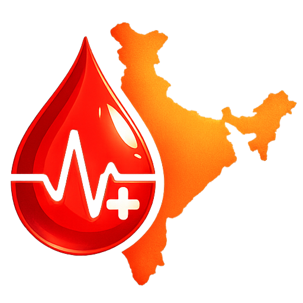

<div align="center">
  

  # 🩸 RaktPort
  **Donate Blood Anywhere. Save Lives Everywhere.**

  [](https://reactjs.org/)
  [](https://vitejs.dev/)
  [](https://www.typescriptlang.org/)
  [](https://firebase.google.com/)
  [](https://tailwindcss.com/)
</div>

## 📖 Overview

**RaktPort** is India's unified blood donation logistics and network platform. It bridges the critical gap between blood donors, hospitals, and blood banks by providing a centralized, real-time ecosystem. Whether scheduling a routine donation, launching an SOS emergency blood request, or managing a city-wide blood inventory, RaktPort ensures that safe blood reaches those in need swiftly and securely.

Originally conceptualized and showcased at the **Grand Finale of the IDEA ONE: National One Health Hackathon** (Bharat Mandapam, New Delhi), RaktPort is built to scale nationwide.

## ✨ Key Features

The platform is divided into tailored interfaces for different user roles to ensure optimal workflows:

### 🩸 For Donors
* **SOS Emergency Alerts:** Receive instant notifications for urgent blood requirements nearby.
* **Locate Camps & Sites:** Interactive mapping to find the nearest blood donation centers and camps.
* **Eligibility Tracking:** Built-in medical eligibility checks before booking appointments.
* **Donation History:** Track past donations, view impact metrics, and download certificates.

### 🏥 For Hospitals
* **Real-Time Blood Requisition:** Instantly raise requests to connected blood banks.
* **Transfusion History & Analytics:** Keep secure records of patient transfusions.
* **Premium Dashboard:** Advanced inventory forecasting and allocation control.

### 🏢 For Blood Banks
* **Inventory Management:** Live-tracking of blood units by type, component, and expiry.
* **Donor Verification:** Scan QR codes and generate Real-Time IDs (RTID) for walk-in or booked donors.
* **Audit Trails:** Comprehensive logging of all inward and outward blood movements.

### 🛡️ Admin & Analytics
* **National & City Ledgers:** High-level oversight of blood supply vs. demand across regions.
* **Fraud & Safety Alerts:** Automated flagging of suspicious activities or critical stock shortages.

## 🛠️ Tech Stack

* **Frontend:** React.js, TypeScript, Vite
* **Styling:** Tailwind CSS, Radix UI Primitives, Lucide Icons
* **Backend/Database:** Firebase (Authentication, Firestore, Cloud Functions)
* **Routing:** React Router v6
* **Security Testing:** OWASP ZAP

## 🔒 Security & Compliance

Developing healthcare technology requires strict adherence to legal and medical frameworks. RaktPort is built with these principles at its core:
* **Data Privacy:** Architecture designed with the Indian Digital Personal Data Protection (**DPDP**) Act guidelines in mind to protect donor and patient identities.
* **Interoperability:** Structuring data flows to align with Ayushman Bharat Digital Mission (**ABDM**) sandbox APIs for future integration with the national digital health ecosystem.
* **Vulnerability Management:** Regularly tested using OWASP ZAP to identify and mitigate potential security threats before deployment.

## 🚀 Getting Started

Follow these steps to set up RaktPort locally on your machine.

### Prerequisites
* Node.js (v18 or higher recommended)
* npm or yarn
* A Firebase Project with Firestore and Authentication enabled.

### Installation

1. **Clone the repository**
   ```bash
   git clone [https://github.com/your-username/raktport.git](https://github.com/your-username/raktport.git)
   cd raktport